<!--
**Selogaz/Selogaz** is a ✨ _special_ ✨ repository because its `README.md` (this file) appears on your GitHub profile.

Here are some ideas to get you started:

- 🔭 I’m currently working on ...
- 🌱 I’m currently learning ...
- 👯 I’m looking to collaborate on ...
- 🤔 I’m looking for help with ...
- 💬 Ask me about ...
- 📫 How to reach me: ...
- 😄 Pronouns: ...
- ⚡ Fun fact: ...
-->
# Привет 👋

Я **Александр Терентьев**, frontend-разработчик.

### Мои проекты:

- **[FriendlySearch](https://github.com/Selogaz/searchengine)** — простой поисковый движок на Java + Spring Boot.
- **[Подземелья Максвелла](https://github.com/Selogaz/front-maxwell)** — онлайн DnD-платформа с ИИ в роли мастера _(в разработке)_.
- *[PomodoroMusicExtension](https://github.com/Selogaz/PomoMusicExtension)* - браузерное расширение, которое автоматически управляет воспроизведением музыки по Pomodoro-таймеру

---

## Статистика




<p align="left">
  
</p>

📊 This week I spent my time on:
<!--START_SECTION:waka-->


**🐱 My GitHub Data** 

> 📦 556.7 kB Used in GitHub's Storage 
 > 
> 🏆 339 Contributions in the Year 2026
 > 
> 🚫 Not Opted to Hire
 > 
> 📜 28 Public Repositories 
 > 
> 🔑 0 Private Repositories 
 > 
**I'm an Early 🐤** 

```text
🌞 Morning                150 commits         ██████░░░░░░░░░░░░░░░░░░░   24.31 % 
🌆 Daytime                246 commits         ██████████░░░░░░░░░░░░░░░   39.87 % 
🌃 Evening                162 commits         ███████░░░░░░░░░░░░░░░░░░   26.26 % 
🌙 Night                  59 commits          ██░░░░░░░░░░░░░░░░░░░░░░░   09.56 % 
```
📅 **I'm Most Productive on Sunday** 

```text
Monday                   70 commits          ███░░░░░░░░░░░░░░░░░░░░░░   11.35 % 
Tuesday                  72 commits          ███░░░░░░░░░░░░░░░░░░░░░░   11.67 % 
Wednesday                58 commits          ██░░░░░░░░░░░░░░░░░░░░░░░   09.40 % 
Thursday                 110 commits         ████░░░░░░░░░░░░░░░░░░░░░   17.83 % 
Friday                   90 commits          ████░░░░░░░░░░░░░░░░░░░░░   14.59 % 
Saturday                 101 commits         ████░░░░░░░░░░░░░░░░░░░░░   16.37 % 
Sunday                   116 commits         █████░░░░░░░░░░░░░░░░░░░░   18.80 % 
```


📊 **This Week I Spent My Time On** 

```text
🕑︎ Time Zone: Europe/Moscow

💬 Programming Languages: 
Markdown                 19 hrs 28 mins      ██████████░░░░░░░░░░░░░░░   38.86 % 
TypeScript               10 hrs 17 mins      █████░░░░░░░░░░░░░░░░░░░░   20.53 % 
SCSS                     8 hrs 9 mins        ████░░░░░░░░░░░░░░░░░░░░░   16.27 % 
Python                   4 hrs 28 mins       ██░░░░░░░░░░░░░░░░░░░░░░░   08.93 % 
HTML                     3 hrs 26 mins       ██░░░░░░░░░░░░░░░░░░░░░░░   06.86 % 

🔥 Editors: 
Claude Code              31 hrs 51 mins      ████████████████░░░░░░░░░   63.58 % 
VS Code                  18 hrs 14 mins      █████████░░░░░░░░░░░░░░░░   36.42 % 

🐱‍💻 Projects: 
bite-transit-static      19 hrs 31 mins      ██████████░░░░░░░░░░░░░░░   38.98 % 
parsing                  8 hrs 42 mins       ████░░░░░░░░░░░░░░░░░░░░░   17.37 % 
dnd-frontend             8 hrs 32 mins       ████░░░░░░░░░░░░░░░░░░░░░   17.05 % 
front-maxwell            5 hrs 59 mins       ███░░░░░░░░░░░░░░░░░░░░░░   11.94 % 
Obsidian-vault-cpp       4 hrs 16 mins       ██░░░░░░░░░░░░░░░░░░░░░░░   08.54 % 

💻 Operating System: 
Linux                    50 hrs 6 mins       █████████████████████████   100.00 % 
```

**I Mostly Code in HTML** 

```text
HTML                     7 repos             █████████░░░░░░░░░░░░░░░░   36.84 % 
TypeScript               4 repos             █████░░░░░░░░░░░░░░░░░░░░   21.05 % 
Java                     3 repos             ████░░░░░░░░░░░░░░░░░░░░░   15.79 % 
SCSS                     2 repos             ███░░░░░░░░░░░░░░░░░░░░░░   10.53 % 
CSS                      1 repo              █░░░░░░░░░░░░░░░░░░░░░░░░   05.26 % 
```


**Timeline**


 Last Updated on 06/07/2026 04:49:10 UTC
<!--END_SECTION:waka-->
