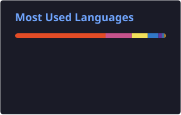

<!--
**Selogaz/Selogaz** is a ✨ _special_ ✨ repository because its `README.md` (this file) appears on your GitHub profile.

Here are some ideas to get you started:

- 🔭 I’m currently working on ...
- 🌱 I’m currently learning ...
- 👯 I’m looking to collaborate on ...
- 🤔 I’m looking for help with ...
- 💬 Ask me about ...
- 📫 How to reach me: ...
- 😄 Pronouns: ...
- ⚡ Fun fact: ...
-->
# Привет! / Hello! 👋

I'm **Alexander Terentyev**, a Frontend Developer passionate about building clean, efficient web applications and optimizing AI-assisted development workflows.  
Я **Александр Терентьев**, frontend-разработчик, увлеченный созданием качественных веб-приложений и оптимизацией рабочих процессов с помощью ИИ.

---

## 🛠 Tech Stack / Стек технологий

- **Frontend**: React, Next.js, TypeScript, Vue.js, TailwindCSS, SCSS, HTML5
- **Tools & Workflow**: Claude Code, VS Code, Git, Webpack, Gulp
- **OS & Environment**: Linux (Manjaro), Zsh, GNOME
- **Currently Learning / Изучаю**: Java, AI Agent integrations, Knowledge Management (Obsidian, Zotero)

---

## 🚀 Current Focus / Текущие проекты

- 🤖 **[AI-software-dev-skills](https://github.com/Selogaz/AI-software-dev-skills)**: Multi-session workflow skills for Claude Code to enforce strict Definition of Done and independent audits.
- 🎲 **Maxwell's Dungeons (Подземелья Максвелла)**: An online AI-powered DnD platform *(in development)*.
- 🚚 **[Bite Transit](https://github.com/Selogaz/bite-transit-static)**: A responsive static website for a logistics company.

---

## 📫 Let's Connect / Связаться со мной

- **Telegram**: [@meaning_inside](https://t.me/meaning_inside) 
- **Email**: terentjev.selogaz@yandex.ru 
- **Portfolio**: [hh.ru](https://tuapse.hh.ru/resume/01c2d309ff0fe3e20f0039ed1f5a695936787a?hhtmFrom=applicant_profile)

---

<details>
<summary>📈 <b>GitHub Stats & Weekly Activity / Статистика и активность</b></summary>
<br>




<p align="left">
  
</p>

📊 This week I spent my time on:
<!--START_SECTION:waka-->


**🐱 My GitHub Data** 

> 📦 540.6 kB Used in GitHub's Storage 
 > 
> 🏆 365 Contributions in the Year 2026
 > 
> 🚫 Not Opted to Hire
 > 
> 📜 25 Public Repositories 
 > 
> 🔑 0 Private Repositories 
 > 
**I'm an Early 🐤** 

```text
🌞 Morning                144 commits         ██████░░░░░░░░░░░░░░░░░░░   23.04 % 
🌆 Daytime                261 commits         ██████████░░░░░░░░░░░░░░░   41.76 % 
🌃 Evening                162 commits         ██████░░░░░░░░░░░░░░░░░░░   25.92 % 
🌙 Night                  58 commits          ██░░░░░░░░░░░░░░░░░░░░░░░   09.28 % 
```
📅 **I'm Most Productive on Sunday** 

```text
Monday                   76 commits          ███░░░░░░░░░░░░░░░░░░░░░░   12.16 % 
Tuesday                  69 commits          ███░░░░░░░░░░░░░░░░░░░░░░   11.04 % 
Wednesday                76 commits          ███░░░░░░░░░░░░░░░░░░░░░░   12.16 % 
Thursday                 108 commits         ████░░░░░░░░░░░░░░░░░░░░░   17.28 % 
Friday                   82 commits          ███░░░░░░░░░░░░░░░░░░░░░░   13.12 % 
Saturday                 101 commits         ████░░░░░░░░░░░░░░░░░░░░░   16.16 % 
Sunday                   113 commits         █████░░░░░░░░░░░░░░░░░░░░   18.08 % 
```


📊 **This Week I Spent My Time On** 

```text
🕑︎ Time Zone: Europe/Moscow

💬 Programming Languages: 
TypeScript               6 hrs 28 mins       ██████████░░░░░░░░░░░░░░░   39.00 % 
Markdown                 4 hrs 33 mins       ███████░░░░░░░░░░░░░░░░░░   27.47 % 
JavaScript               2 hrs 9 mins        ███░░░░░░░░░░░░░░░░░░░░░░   12.96 % 
HTML                     1 hr 2 mins         ██░░░░░░░░░░░░░░░░░░░░░░░   06.30 % 
Python                   57 mins             █░░░░░░░░░░░░░░░░░░░░░░░░   05.73 % 

🔥 Editors: 
Claude Code              13 hrs 58 mins      █████████████████████░░░░   84.29 % 
VS Code                  2 hrs 36 mins       ████░░░░░░░░░░░░░░░░░░░░░   15.71 % 

🐱‍💻 Projects: 
dnd-frontend             8 hrs 51 mins       █████████████░░░░░░░░░░░░   53.46 % 
artefacts                3 hrs 42 mins       ██████░░░░░░░░░░░░░░░░░░░   22.37 % 
bite-transit-static      2 hrs 23 mins       ████░░░░░░░░░░░░░░░░░░░░░   14.44 % 
parsing                  1 hr 13 mins        ██░░░░░░░░░░░░░░░░░░░░░░░   07.36 % 
shoptet                  14 mins             ░░░░░░░░░░░░░░░░░░░░░░░░░   01.48 % 

💻 Operating System: 
Linux                    16 hrs 35 mins      █████████████████████████   100.00 % 
```

🤖 **AI Coding This Week** 

```text
⏱ AI Coding Time: 16 hrs 23 mins (98.82%)

✍️ 9,216 lines written by AI, 440 lines written by hand (95.44% AI-written)

🔤 310,414,296 Input Tokens, 1,358,692 Output Tokens

💵 $1329.65 Estimated AI Cost This Week

🧠 26 AI Sessions, 63 AI Prompts

Opus                     8,545 lines         ███████████████████████░░   92.68 % 
Sonnet                   610 lines           ██░░░░░░░░░░░░░░░░░░░░░░░   06.62 % 
Opencode-Cli             64 lines            ░░░░░░░░░░░░░░░░░░░░░░░░░   00.69 % 
Fable                    1 lines             ░░░░░░░░░░░░░░░░░░░░░░░░░   00.01 % 
Claude-Code              0 lines             ░░░░░░░░░░░░░░░░░░░░░░░░░   00.00 % 

🔎 AI Coding Insights:
🤖 AI-Driven — 95.44% of written lines came from AI
📚 Verbose Prompter — average 2,711 characters per prompt
🔁 Iterative Prompter — average 2 prompts per session
🚀 High AI Trust — 4.5% of changed lines were hand-edited
```

**I Mostly Code in HTML** 

```text
HTML                     5 repos             ███████░░░░░░░░░░░░░░░░░░   29.41 % 
TypeScript               4 repos             ██████░░░░░░░░░░░░░░░░░░░   23.53 % 
Java                     3 repos             ████░░░░░░░░░░░░░░░░░░░░░   17.65 % 
Shell                    1 repo              █░░░░░░░░░░░░░░░░░░░░░░░░   05.88 % 
SCSS                     1 repo              █░░░░░░░░░░░░░░░░░░░░░░░░   05.88 % 
```


**Timeline**


 Last Updated on 05/08/2026 03:42:14 UTC
<!--END_SECTION:waka-->
</details>
